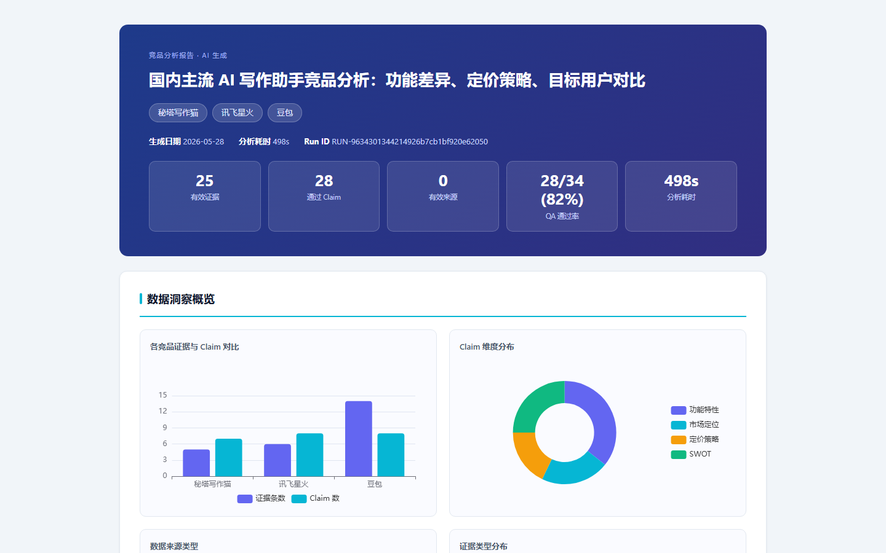
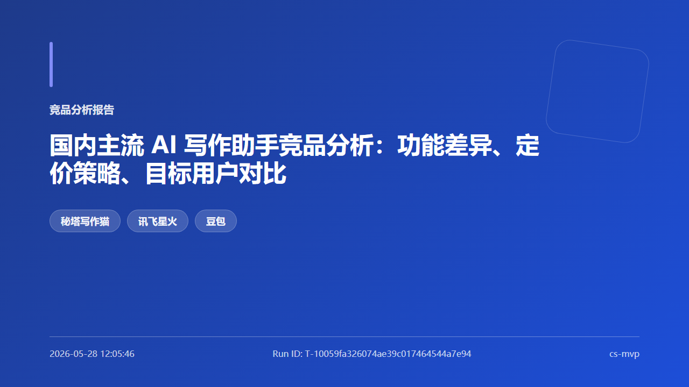
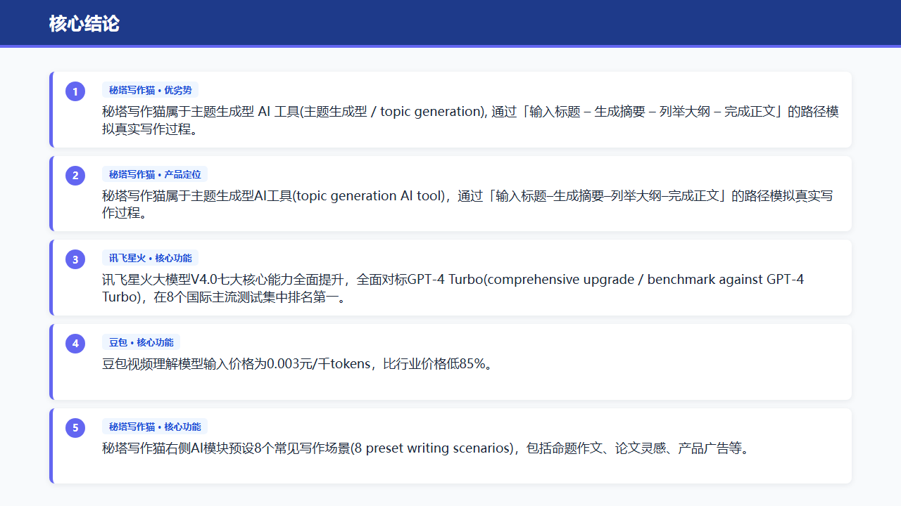
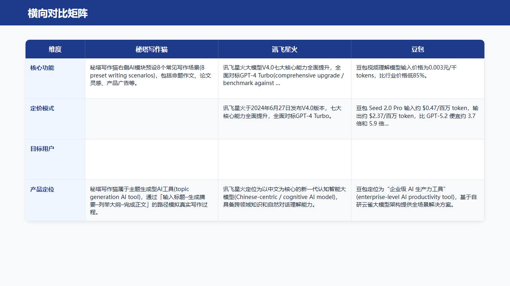
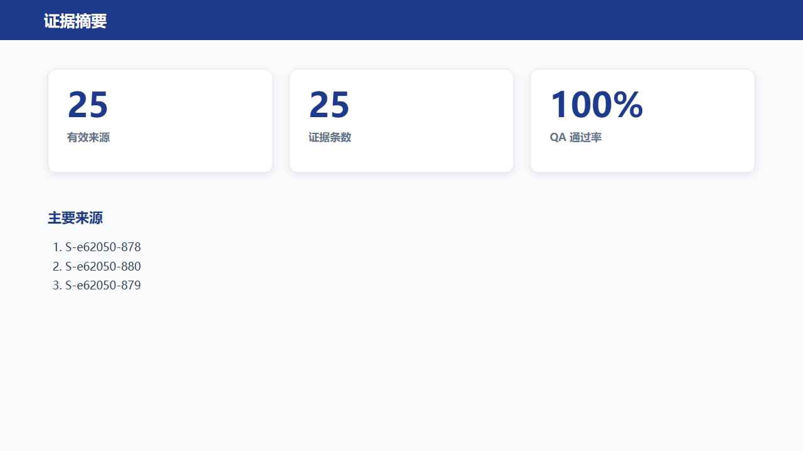
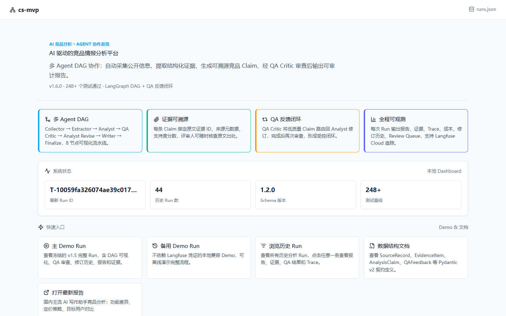
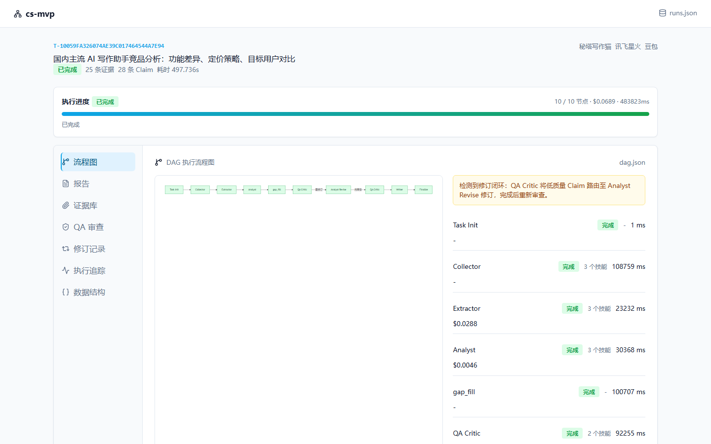

# CI-Agent：AI 竞品情报分析 Agent 系统

> 一个面向竞品分析报告生成的多 Agent 协作系统 Demo，支持从用户问题出发，经过公开信息采集、证据提取、多维度分析、QA 质检审查与动态补采，生成带证据溯源的结构化分析报告。


---

## 为什么需要这个项目

产品团队在做路线图、定价、GTM 决策前需要竞品分析。传统流程的问题：

| 痛点 | 实际情况 |
|------|---------|
| 重复人工搜索 | PM 反复搜同一批页面，手动复制粘贴到笔记 |
| 来源分散、容易过时 | 定价页、文档、博客、评测分散在各处，抓取一批就又更新了 |
| 结论缺乏依据 | 最终报告里的判断往往找不到原始出处 |
| 分析质量依赖个人经验 | 不同人写出来的竞品报告深度差异很大 |

CI-Agent 把竞品分析变成一条可重复执行的 Agent 工作流：自动采集公开信息 → 提取结构化证据 → 生成多维度分析结论 → QA 审查 → 输出可溯源报告。

---

## 输出样例

一次 AI 写作助手竞品分析（秘塔写作猫 / 讯飞星火 / 豆包）的实际输出：

### HTML 报告（带 ECharts 交互图表）



- 5 项核心指标卡：有效来源数、Claim 数、QA 通过率、分析耗时、成本
- 4 张交互图表：竞品证据对比、Claim 维度分布、来源类型分布、证据类型分布
- 横向对比矩阵：竞品 × 维度的交叉分析表格
- 完整正文：每条结论附 evidence ID，可追溯到原始网页引用

### PPT 视觉版（5 页，HTML/CSS 截图生成）

<table>
<tr>
<td width="50%"></td>
<td width="50%"></td>
</tr>
<tr>
<td></td>
<td></td>
</tr>
</table>

- **第 1 页 封面**：深蓝渐变背景 + 分析问题大标题 + 竞品圆角标签
- **第 2 页 核心结论**：按引用支持度排序的前 5 条通过审查的 Claim
- **第 3 页 横向对比矩阵**：行=分析维度，列=竞品，单元格内容来自 `claims.json`
- **第 4 页 证据摘要**：有效来源数、证据条数、QA 通过率三张大数字卡
- **第 5 页 分析说明**：任务 ID、耗时、成本等元数据

### Dashboard（FastAPI + HTMX 实时可观测面板）

> Claim、Evidence、QA Critic、Analyst、Writer 等术语沿用代码内类名 / 字段名，便于读源码时一一对应。



首页展示系统状态、能力卡片、历史 Run 入口。



任务详情页可视化 8 节点 DAG 执行状态，右侧列出每个节点的耗时和成本。**橙色提示框**标识 QA 反馈闭环触发：QA Critic 将低质量 Claim 路由至 Analyst Revise 修订后重新审查。

其他标签页包含：报告预览、证据库、QA 审查详情、修订记录前后对比、执行追踪明细。

---

## 真实运行指标

| 分析主题 | 竞品 | 耗时 | 成本 | Claim 数 | QA 通过率 |
|---------|------|------|------|---------|---------|
| AI 写作助手 | 秘塔写作猫 / 讯飞星火 / 豆包 | 320s | $0.059 | 28 | 89% |
| AI 代码编辑器 | Cursor / Copilot / Tabnine | ~90s | $0.05 | 27 | 100% |
| 向量数据库 | Milvus / Qdrant / Weaviate | 252s | $0.08 | 14 | 93% |

有效来源采集率：**96%**（三层采集兜底，含 Vision OCR 突破反爬）

---

## 核心设计

### Agent 协作流程

```
用户输入（竞品名 + 分析问题）
    ↓
Collector     采集公开来源（Tavily 搜索 + 多层爬取兜底）
    ↓
Extractor     提取结构化证据（quote + evidence_id + 置信度）
    ↓
Analyst       生成 AnalysisClaim（6 维度 × 每竞品）
    ↓
gap_fill      检测维度空格，针对性补采（动态决策）
    ↓
QA Critic     独立审查每条 Claim → accepted / risky / needs_revision
    ↓         （needs_revision 触发 Analyst Revise → 再次 QA，最多 1 轮）
Writer        生成报告（只写审查通过的 Claim）
    ↓
Finalize      HTML 报告 + PPT + trace.json + run_summary
```

### 证据优先原则

每条分析结论（Claim）都必须：
1. 引用 1-3 个 `evidence_id`，指向具体网页原文
2. 通过 CitationVerifier 的关键词匹配打分（`support_score`）
3. 经过 QA Critic 独立审查，不直接进入报告

### QA 反馈闭环

QA Critic 节点位于 Writer 之前，独立评审每条 Claim。标记为 `needs_revision` 的 Claim 会触发 Analyst Revise，按具体修改指令重写，再由 QA Critic 复审。最终报告只包含通过审查的内容。

### 动态补采（gap_fill）

Analyst 完成后检测 features / pricing / target_users / positioning 四个核心维度是否有空格，发现空格则针对该竞品 + 该维度发起专项搜索，最多补 3 个 URL、1 轮。补采来源以 `S-GAP-` 前缀标识，在 Dashboard 证据库可见。

### 三层采集兜底

```
httpx 请求
  └── 失败/403/空内容
        └── Playwright headless（JS 渲染 + 滚动触发懒加载）
              └── 内容仍不足（反爬骨架屏）
                    └── Vision LLM 截图 OCR（需配置 VISION_API_KEY）
```

---

## 快速开始

### 安装

```bash
git clone https://github.com/MasterGenm/ci-agent-demo.git
cd ci-agent-demo
pip install -e .
cp .env.example .env
# 编辑 .env，填入 TAVILY_API_KEY 和 LLM 配置
```

### 最小配置（`.env`）

```bash
TAVILY_API_KEY=tvly-xxx

LLM_PROVIDER=openai
OPENAI_API_KEY=sk-xxx
OPENAI_BASE_URL=https://api.deepseek.com   # DeepSeek 推荐，成本最低
EXTRACTOR_MODEL=deepseek-chat
```

### 运行分析

```bash
python -m cs_mvp.cli run \
  --query "国内主流 AI 写作助手竞品分析：功能差异、定价策略、目标用户对比" \
  --competitors "秘塔写作猫,讯飞星火,豆包"
```

分析完成后报告写入 `runs/<task_id>/`，包含 `report.html`、`report.pptx`、`claims.json` 等。

### 启动 Dashboard

```bash
python -m cs_mvp.cli serve --host 127.0.0.1 --port 8003
```

打开浏览器访问 `http://127.0.0.1:8003`，可查看历史 Run、报告、证据库、QA 审查详情。

### Vision OCR（可选，用于突破反爬）

```bash
# 在 .env 中添加：
VISION_API_KEY=sk-xxx                              # Kimi API key
VISION_BASE_URL=https://api.moonshot.cn/v1
VISION_MODEL=moonshot-v1-128k-vision-preview
```

配置后，Playwright 拿到骨架屏的页面会自动截图发给 Kimi 识别，无需其他改动。

### Docker 部署

```bash
docker build -t ci-agent .
docker run --rm -p 8003:8003 -v ./runs:/app/runs --env-file .env ci-agent
```

---

## 项目结构

```
cs_mvp/
├── agents/
│   ├── collector.py          # 采集节点：Tavily 搜索 + 多层爬取
│   ├── extractor.py          # 证据提取节点：网页文本 → EvidenceItem
│   ├── analyst.py            # 分析节点：证据 → 6 维度 AnalysisClaim
│   ├── gap_fill.py           # 动态补采节点：检测维度空格 → 针对性搜索
│   ├── qa_critic.py          # 质检审查节点：独立评审每条 Claim
│   ├── analyst_revise.py     # 修订节点：按 QA 指令重写低质量 Claim
│   ├── writer.py             # 报告生成节点：审计报告 + PM 简报
│   ├── ppt_visual_builder.py # PPT 生成：HTML/CSS 截图 → pptx
│   └── ppt_slides/           # 5 张幻灯片 HTML 模板
├── tools/
│   ├── fetch.py              # 三层采集（httpx / Playwright / Vision OCR）
│   ├── search.py             # Tavily 搜索 + 死域名过滤
│   ├── citation.py           # 引用核验：关键词与数字命中打分
│   └── llm.py                # LLM 统一入口（多家服务商兼容）
├── web/
│   ├── app.py                # FastAPI 应用入口
│   └── templates/            # Jinja2 + HTMX 模板
├── prompts/                  # 各 Agent 的 prompt 文本文件
├── models.py                 # Pydantic v2 数据模型
└── graph.py                  # LangGraph DAG 定义
```

---

## 技术栈

| 层次 | 选型 |
|------|------|
| Agent 编排 | LangGraph（条件边 DAG + 反馈闭环） |
| 数据模型 | Pydantic v2（GraphState、AnalysisClaim、EvidenceItem 等） |
| LLM | 任意 OpenAI 兼容端点（DeepSeek / Kimi / 智谱 / GPT 等） |
| 网页采集 | httpx + BeautifulSoup + Playwright headless |
| Vision OCR | OpenAI 兼容 Vision API（Kimi / GPT-4V，可选） |
| 搜索 | Tavily Search API |
| Web 框架 | FastAPI + Jinja2 + HTMX |
| PPT 生成 | python-pptx + Playwright 截图 |
| 可观测性 | 本地 JSON artifacts + 可选 Langfuse Cloud |
| 测试 | pytest（274 passing）+ Playwright e2e |
| CI/CD | GitHub Actions（test / lint / build） |
| 容器化 | Docker + docker-compose |

---

## 版本历史

| 版本 | 关键特性 |
|------|---------|
| v1.0 | 基础 5 节点 DAG，mock 数据验证流程 |
| v1.1 | 真实爬取，Tavily 搜索，双语查询扩展 |
| v1.2 | QA Critic 独立节点，FastAPI Dashboard，HTML 报告重构 |
| v1.2.1 | Playwright 回退，搜索词扩展，对比矩阵，PPT 输出 |
| v1.2.2 | 死域名过滤（fetched 率 44%→96%），视觉版 PPT |
| v1.2.3 | gap_fill 动态补采节点，Vision LLM 反爬 OCR |

---

## 开源协议

MIT License — 详见根目录 `LICENSE` 文件。
