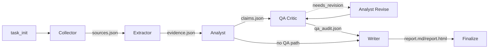

# cs-mvp Agent RoleCard Contracts

cs-mvp v1.5 Batch 2 makes the six runtime agents explicit as RoleCards.
The design borrows the useful parts of crewAI's role / goal / backstory /
expected output pattern, but keeps cs-mvp on its existing LangGraph runtime.

RoleCards are declarative metadata. They do not change Agent node behavior,
prompt text, graph topology, persisted artifacts, or report templates.

## 0. Data Flow



The RoleCard registry covers the six business agents:

1. Collector
2. Extractor
3. Analyst
4. QA Critic
5. Analyst Revise
6. Writer

`task_init` and `finalize` are graph nodes but not business agents, so they do
not have RoleCards.

## 1. RoleCard Schema

| Field | Type | Meaning |
| --- | --- | --- |
| `name` | literal | Stable runtime name used by LangGraph and dashboard lookup. |
| `role` | string | One-sentence role positioning for humans and dashboard hover. |
| `goal` | string | What this agent must achieve inside the research workflow. |
| `backstory` | string | Human-readable context for portfolio/demo explanation. |
| `inputs` | list[str] | Expected input artifacts or state fields. |
| `outputs` | list[str] | Produced artifacts or downstream state fields. |
| `tools` | list[str] | Tools, libraries, or local modules used by the agent. |
| `quality_rules` | list[str] | Hard constraints summarized from existing implementation. |
| `upstream` | list[AgentName] | Agents that feed this agent. |
| `downstream` | list[AgentName] | Agents that consume this agent's output. |
| `prompt_family_hint` | string or null | Preferred PromptFamily, if the agent uses LLM prompts. |

Implementation location:

```text
cs_mvp/agents/role_card.py
cs_mvp/agents/role_cards/
```

Dashboard integration:

```text
cs_mvp/web/services/artifact_reader.py
cs_mvp/web/templates/_dag.html
```

## 2. Agent Details

### 2.1 Collector

| Field | Value |
| --- | --- |
| name | `collector` |
| role | 公开信息采集与网页抓取者 |
| upstream | none |
| downstream | `extractor` |
| prompt_family_hint | none |

Goal:

把用户的调研问题和竞品列表转化为可复验的公开 source artifact, 并保留抓取失败与召回污染线索。

Inputs:

| Input | Source |
| --- | --- |
| `task.query` | user query |
| `task.competitors` | user competitor list |
| `task.competitors[*].seed_urls` | optional seed URLs |
| `task.competitors[*].exclude_keywords` | recall filter hints |

Outputs:

| Output | Meaning |
| --- | --- |
| `sources.json` | list of `SourceRecord` |
| `source_summary.json` | source quality summary |

Tools:

| Tool | Use |
| --- | --- |
| Tavily | public search |
| httpx | web fetch |
| BeautifulSoup | HTML parsing |
| lxml | parser support |
| url_utils | URL classification, dedupe, rerank |

Quality rules:

| Rule | Implementation source |
| --- | --- |
| Every `SourceRecord` has `source_id`, `run_id`, `competitor_name`, and `url`. | Pydantic model and `_to_source_record` |
| Failed or empty sources keep `fetch_status` and `failure_reason`. | `fetch()` result mapping |
| Seed URL path bypasses search and is preserved. | `real_collect(seed_urls=...)` |
| URLs are deduped and reranked before fetch. | `dedupe_urls`, `rerank_results` |
| Reliability score is derived from source type. | `RELIABILITY_BY_SOURCE_TYPE` |

### 2.2 Extractor

| Field | Value |
| --- | --- |
| name | `extractor` |
| role | 证据抽取与事实归一化者 |
| upstream | `collector` |
| downstream | `analyst` |
| prompt_family_hint | `qwen` |

Goal:

把已抓取 source 的 raw_text 切分并压缩为 EvidenceItem, 每条证据都保留 quote、source_id、claim_type 与置信度。

Inputs:

| Input | Source |
| --- | --- |
| `sources.json` | Collector artifact |
| `SourceRecord.raw_text` | fetched page text |
| extractor budget config | environment/settings |

Outputs:

| Output | Meaning |
| --- | --- |
| `evidence.json` | list of `EvidenceItem` |
| `evidence_summary.json` | evidence quality summary |
| `extractor_failures.json` | schema/quote/chunk failures |

Tools:

| Tool | Use |
| --- | --- |
| TextChunker | split source raw text |
| Pydantic structured output | validate LLM output |
| LLM | evidence extraction |
| cost estimator | budget accounting |

Quality rules:

| Rule | Implementation source |
| --- | --- |
| Only fetched sources with non-empty raw text are processed. | `valid_sources` filter |
| LLM output must validate as `LLMEvidenceList`. | `_parse_structured_result` |
| Quote must appear in raw text. | `quote_in_raw` |
| Quote length must be between 50 and 500 characters. | quote length guard |
| Duplicate `(competitor_name, normalized_fact)` pairs are removed. | `seen_keys` |
| Work stops when accumulated cost exceeds 1.5x max budget. | `budget_exhausted` guard |

### 2.3 Analyst

| Field | Value |
| --- | --- |
| name | `analyst` |
| role | 结构化竞品分析与洞察生成者 |
| upstream | `extractor` |
| downstream | `qa_critic`, `writer` |
| prompt_family_hint | `qwen` |

Goal:

基于 evidence 生成单竞品 claim、跨竞品 claim 和轻量商业洞察, 覆盖功能、定价、定位、SWOT、目标用户和战略启示。

Inputs:

| Input | Source |
| --- | --- |
| `evidence.json` | Extractor artifact |
| `task.competitors` | task state |
| analysis dimensions | local constants |

Outputs:

| Output | Meaning |
| --- | --- |
| `claims.json` | accepted/report-visible claims after Writer |
| `discarded_claims.json` | weak or failed claims after Writer |
| `analyst_failures.json` | Analyst generation validation failures |

Tools:

| Tool | Use |
| --- | --- |
| Pydantic structured output | validate `LLMClaimList` and cross claims |
| LLM | generate claims |
| evidence grouping | per competitor and dimension slicing |
| bilingual validator | enforce bilingual statements |
| cost estimator | estimate analysis cost |

Quality rules:

| Rule | Implementation source |
| --- | --- |
| Single claim must be bilingual. | `is_bilingual` guard |
| Single claim dimension must match the current dimension slice. | `dimension_mismatch` guard |
| All `evidence_ids` must exist in `evidence_by_id`. | `invalid_evidence_ids` guard |
| Wrong `competitor_name` is corrected to the current slice. | competitor override |
| Cross claim must reference evidence from at least two competitors. | `cross_claim_single_competitor` guard |
| Insight phase caps each competitor/dimension at two claims. | `dimension_counts` cap |

### 2.4 QA Critic

| Field | Value |
| --- | --- |
| name | `qa_critic` |
| role | 独立质检与修订反馈审查者 |
| upstream | `analyst` |
| downstream | `analyst_revise`, `writer` |
| prompt_family_hint | `qwen` |

Goal:

读取 claim、evidence、verifier 和 rescue 状态, 给出 accepted、needs_revision 或 risky 的交叉审查反馈。

Inputs:

| Input | Source |
| --- | --- |
| `claims.json` | Analyst/Writer pipeline |
| `evidence.json` | Extractor artifact |
| `rescue_outcomes.json` | optional LLM rescue artifact |
| `claim.verifier_state` | Writer/verifier state |

Outputs:

| Output | Meaning |
| --- | --- |
| `qa_audit.json` | structured QA audit |
| `qa_summary.md` | human-readable QA summary |

Tools:

| Tool | Use |
| --- | --- |
| LLM | judge claim/evidence alignment |
| QAFeedback schema | validate feedback |
| semantic judge context | include rescue/verifier state |

Quality rules:

| Rule | Implementation source |
| --- | --- |
| Label must be `accepted`, `needs_revision`, or `risky`. | `_VALID_LABELS` |
| Reason is required. | `_validate_feedback_payload` |
| Issue tags are restricted to known tags. | `_VALID_ISSUE_TAGS` |
| Non-revision labels clear revision suggestions. | `_validate_feedback_payload` |
| LLM/schema failure becomes `risky`, not a pipeline crash. | retry fallback |

### 2.5 Analyst Revise

| Field | Value |
| --- | --- |
| name | `analyst_revise` |
| role | 受控二次生成与证据边界修订者 |
| upstream | `qa_critic` |
| downstream | `qa_critic` |
| prompt_family_hint | `qwen` |

Goal:

只处理 QA Critic 标记为 needs_revision 的 claim, 严格按 revision_instruction 改写且不新增 evidence。

Inputs:

| Input | Source |
| --- | --- |
| `claims.json` | claim pool |
| `qa_audit.json` | QA feedback |
| `evidence.json` | allowed evidence map |
| `revision_round` | graph state |

Outputs:

| Output | Meaning |
| --- | --- |
| `revision_history.json` | revision audit trail |
| `revision_summary.md` | human-readable revision summary |
| revised AnalysisClaim list | graph state update |

Tools:

| Tool | Use |
| --- | --- |
| LLM | rewrite claim |
| LLMRevision schema | validate rewrite |
| cost estimator | cost accounting |

Quality rules:

| Rule | Implementation source |
| --- | --- |
| Only `needs_revision` feedback is processed. | `revise_claim` label guard |
| Kept evidence IDs must be subset of original claim evidence IDs. | `invalid_evidence_ids` guard |
| Empty evidence IDs fail revision. | `empty_kept_evidence_ids` |
| Empty statement fails revision. | `empty_revised_statement` |
| Every attempt writes a `RevisionRecord` with before/after context. | `_base_record` and `RevisionRecord` |

### 2.6 Writer

| Field | Value |
| --- | --- |
| name | `writer` |
| role | 结构化报告组装与质量门守门者 |
| upstream | `qa_critic` |
| downstream | none |
| prompt_family_hint | `qwen` |

Goal:

把 verifier 通过、cross claim、风险项和洞察候选组装为 report.md/report.html, 同时保留审计型 claims artifact。

Inputs:

| Input | Source |
| --- | --- |
| `claims.json` | analysis claims |
| `evidence.json` | source evidence |
| `task` | competitors and query |
| `node_modes` | graph node modes |

Outputs:

| Output | Meaning |
| --- | --- |
| `report.md` | final Markdown report |
| `report.html` | exported HTML report |
| `writer_stats.json` | summary cost/stats |
| `claims.json` | audit-facing accepted/report claims |

Tools:

| Tool | Use |
| --- | --- |
| CitationVerifier | support scoring |
| Jinja2 | report rendering |
| LLM rescue | optional uncertain claim rescue |
| interpretive guard | risky wording scan |

Quality rules:

| Rule | Implementation source |
| --- | --- |
| Single claim follows verifier pass/uncertain/fail classification. | `verify_claim` path |
| Cross claim is shown in comparison while still receiving a support score. | raw cross path |
| Risks are capped and require score floor 0.30. | `_RISKS_MAX_PER_REPORT` and `_RISKS_MIN_SCORE_FLOOR` |
| Insight candidates are written as `accepted=False`. | `insight_artifacts` |
| Executive Summary falls back to template if LLM generation fails. | `_build_executive_summary` |

## 3. crewAI Comparison

| Dimension | crewAI | cs-mvp RoleCard |
| --- | --- | --- |
| Role | `role` field | `name` + `role` |
| Goal | `goal` field | `goal` |
| Backstory | `backstory` field | `backstory` |
| Expected output | task `expected_output` | `outputs` + `quality_rules` |
| Tools | Agent tools | `tools` metadata |
| Runtime orchestration | Crew process | LangGraph StateGraph |
| Revision loop | process/task dependent | explicit conditional edge |
| Data contract | often task-specific | Pydantic v2 + artifacts |

Why not replace LangGraph with crewAI:

1. LangGraph already expresses the conditional QA loop precisely.
2. Existing checkpoints, trace artifacts, and dashboard depend on LangGraph nodes.
3. RoleCards are sufficient for portfolio readability without runtime migration.
4. Adding crewAI would introduce a new dependency and a second orchestration model.

## 4. Actual Uses In v1.5

| Use | Implementation |
| --- | --- |
| Documentation | This file expands all six RoleCards for review. |
| Dashboard | DAG node rows expose role + goal via HTML title tooltip. |
| API JSON | `/runs/{task_id}/dag.json` includes `role_card` metadata. |
| Langfuse | Chain span metadata can include `agent_role`. |
| Tests | RoleCard registry, schema, topology, and JSON serialization are covered. |

## 5. Future Uses

The current batch intentionally stops at declarative metadata.

Possible future extensions:

1. Role-level latency/cost baseline.
2. Agent-specific failure mode dashboards.
3. PromptFamily A/B tests by role.
4. Per-role eval datasets in Langfuse.
5. RoleCard-driven interview/demo explanations.

Deferred items:

1. No runtime prompt injection from RoleCard.
2. No per-agent skill engine.
3. No new graph nodes.
4. No agent marketplace abstraction.
5. No extra dependency on crewAI.

## 6. SkillCard Extension

v1.6 adds a complementary SkillCard and CapabilityContract layer in `docs/AGENT_SKILLS.md`.

RoleCards answer "who is this Agent and what is its role"; SkillCards answer "what concrete capabilities does this Agent expose, what can fail, and which artifacts prove it happened".

This layer is read-only metadata. It does not replace RoleCards, modify prompts, or change LangGraph routing.
