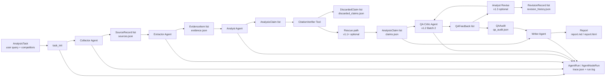

# cs-mvp 数据 Schema

**Schema Version**: 1.2.0  
**适用范围**: cs-mvp v1.2+ 所有 run 产生的 artifact

## 0. 概述

cs-mvp 是 AI 驱动竞品分析 Agent 协作系统,基于 LangGraph DAG 编排多个 Agent 协同工作。本文档说明 Agent 间流转的数据结构契约,用于后续 QA Critic、Dashboard、trace 展示和演示验收。

本文只定义数据模型与 artifact 契约,不改变现有业务逻辑。v1.2 Batch 1 只显式化 Schema,不接入 QA Critic Agent,不改 DAG,不写真实 `qa_audit.json`。

## 1. 数据流图



数据流要点:

- `AnalysisTask` 定义本次调研的输入范围。
- `Collector` 产生 `SourceRecord`,代表公开信息来源。
- `Extractor` 从来源中抽取 `EvidenceItem`,作为可追溯证据片段。
- `Analyst` 产出 `AnalysisClaim`,代表分析结论。
- `CitationVerifier` 计算 `support_score`,把 claim 分为 accepted / uncertain / fail。
- `Rescue path` 在 v1.1+ 可选启用,只救援 uncertain claim。
- `QA Critic` 从 Batch 2 起读取 claims/evidence/verifier 信息,产出 `QAAudit`。
- `Writer` 负责最终报告组织,并保留 evidence appendix。

## 2. 核心数据模型

### 2.1 AnalysisTask

由 CLI 或未来 Web 入口创建,表示一次竞品分析任务。

| 字段名 | 类型 | 必填 | 说明 |
|---|---|---:|---|
| `task_id` | `str` | 是 | 任务 ID,通常形如 `T-...` |
| `query` | `str` | 是 | 用户调研问题 |
| `competitors` | `list[CompetitorInput]` | 是 | 本次分析的竞品输入 |
| `schema_version` | `str` | 否 | v1.2 新增,默认 `1.2.0` |
| `scope` | `TaskScope` | 否 | 地域、语言、时间窗口 |
| `status` | `planned/running/completed/failed` | 否 | 任务生命周期状态 |
| `created_at` | `datetime` | 否 | 创建时间 |
| `completed_at` | `datetime | None` | 否 | 完成时间 |
| `error_message` | `str | None` | 否 | 失败原因 |

### 2.2 CompetitorInput / TaskScope

`CompetitorInput` 描述一个竞品输入及搜索约束。

| 字段名 | 类型 | 必填 | 说明 |
|---|---|---:|---|
| `name` | `str` | 是 | 竞品名称 |
| `website` | `str | None` | 否 | 官网或主站,当前多由 seed URL 替代 |
| `aliases` | `list[str]` | 否 | 搜索别名 |
| `exclude_keywords` | `list[str]` | 否 | 消歧排除词 |
| `seed_urls` | `list[str]` | 否 | 用户指定的直接抓取 URL |

`TaskScope` 描述调研范围。

| 字段名 | 类型 | 必填 | 说明 |
|---|---|---:|---|
| `geography` | `str` | 否 | 默认 `global` |
| `language` | `str` | 否 | 默认 `zh-CN` |
| `time_window` | `str` | 否 | 默认 `last_12_months` |

### 2.3 SourceRecord

由 Collector 产生,表示一个公开信息来源。

| 字段名 | 类型 | 必填 | 说明 |
|---|---|---:|---|
| `source_id` | `str` | 是 | 来源 ID |
| `run_id` | `str` | 是 | 所属 run |
| `competitor_name` | `str` | 是 | 关联竞品 |
| `url` | `str` | 是 | 来源 URL |
| `title` | `str | None` | 否 | 页面标题 |
| `source_type` | `official_site/pricing/docs/blog/news/other` | 否 | 来源类型 |
| `retrieved_at` | `datetime` | 否 | 抓取时间 |
| `published_at` | `datetime | None` | 否 | 发布时间,若可得 |
| `content_hash` | `str | None` | 否 | 内容 hash,用于去重 |
| `raw_text` | `str | None` | 否 | 抽取出的正文 |
| `reliability_score` | `float` | 否 | 来源可靠性粗评分 |
| `fetch_status` | `fetched/failed/skipped/empty` | 否 | 抓取状态 |
| `failure_reason` | `timeout/non_200/parse_empty/too_short/blocked/duplicate/unknown | None` | 否 | 抓取失败原因 |
| `raw_text_length` | `int` | 否 | 正文长度 |

### 2.4 EvidenceItem

由 Extractor 产生,表示可引用的事实证据片段。

| 字段名 | 类型 | 必填 | 说明 |
|---|---|---:|---|
| `evidence_id` | `str` | 是 | 证据 ID |
| `source_id` | `str` | 是 | 来源 ID |
| `competitor_name` | `str` | 是 | 关联竞品 |
| `claim_type` | `feature/pricing/positioning/metric/other` | 否 | 证据类别 |
| `quote` | `str` | 是 | 原文片段 |
| `normalized_fact` | `str | None` | 否 | 标准化事实描述 |
| `confidence` | `float | None` | 否 | 抽取置信度 |
| `extracted_at` | `datetime` | 否 | 抽取时间 |
| `source_chunk_index` | `int | None` | 否 | 来源切块索引 |

### 2.5 AnalysisClaim

由 Analyst 产生,经 CitationVerifier 评分,可被 v1.1 Rescue path 救援。

| 字段名 | 类型 | 必填 | 说明 |
|---|---|---:|---|
| `claim_id` | `str` | 是 | claim ID |
| `run_id` | `str` | 是 | 所属 run |
| `competitor_name` | `str | None` | 否 | 单竞品 claim 填名称;cross claim 为 `None` |
| `dimension` | `features/pricing/positioning/swot/target_users/strategic_implications` | 是 | 分析维度 |
| `statement` | `str` | 是 | claim 文本 |
| `evidence_ids` | `list[str]` | 是 | 支撑证据 ID 列表 |
| `support_score` | `float | None` | 否 | verifier 关键词支持分 |
| `confidence` | `float | None` | 否 | Analyst 自评置信度 |
| `accepted` | `bool` | 否 | Writer 阶段最终是否作为 accepted 输出 |
| `rescued_by_llm_judge` | `bool` | 否 | v1.1 是否由 LLM judge 救援 |
| `rescue_judge_verdict` | `str | None` | 否 | rescue judge verdict |
| `rescue_judge_confidence` | `float | None` | 否 | rescue judge 置信度 |
| `rescue_gates_passed` | `list[str] | None` | 否 | rescue 通过的 gate |
| `rescue_original_score` | `float | None` | 否 | rescue 前 support_score |
| `interpretive_risk` | `bool` | 否 | 是否命中解释性风险词 |
| `interpretive_hits` | `list[str] | None` | 否 | 命中的解释性词 |
| `insight_candidate` | `bool` | 否 | 是否进入 Insight Candidates |

### 2.6 DiscardedClaim

由 Writer 调用 CitationVerifier 后产生,记录 fail / uncertain 的原始裁决。

| 字段名 | 类型 | 必填 | 说明 |
|---|---|---:|---|
| `claim_id` | `str` | 是 | 对应 claim ID |
| `statement` | `str` | 是 | claim 文本 |
| `evidence_ids` | `list[str]` | 是 | 原始 evidence ID |
| `support_score` | `float` | 是 | verifier 支持分 |
| `verdict` | `fail/uncertain` | 是 | 三态裁决中的非 accepted 状态 |
| `reason` | `str` | 是 | verifier 原因 |
| `dropped_at` | `datetime` | 否 | 记录时间 |

### 2.7 QAFeedback / QAAudit (v1.2 新增)

`QAFeedback` 是 QA Critic 对单条 claim 的判定。Batch 1 只定义模型,Batch 2 才由独立 Agent 产生。

| 字段名 | 类型 | 必填 | 说明 |
|---|---|---:|---|
| `claim_id` | `str` | 是 | 被质检 claim |
| `label` | `accepted/needs_revision/risky` | 是 | QA 标签 |
| `reason` | `str` | 是 | QA Critic 判定理由 |
| `issue_tags` | `list[str]` | 否 | 问题标签 |
| `suggested_revision` | `str | None` | 否 | 建议改写,v1.2 可空 |
| `revision_instruction` | `str | None` | 否 | v1.3 Analyst Revise 严格执行的改写指令 |

`label` 语义:

- `accepted`: claim 经 QA Critic 审查通过,可进入主报告。
- `needs_revision`: claim 存在明显问题,例如 Analyst 解读漂移、跨证据综合过激、维度错配。v1.3 可在 `ENABLE_REVISION_LOOP=1` 时触发一次受控改写。
- `risky`: claim 边缘可疑或证据字面对齐弱,建议人工复核。

建议 `issue_tags` 候选清单:

- `interpretive_drift`
- `weak_evidence_alignment`
- `cross_claim_overreach`
- `dimension_mismatch`
- `stale_evidence`
- `single_source_risk`
- `missing_source_context`

`QAAudit` 是整个 run 的质检报告,后续写盘到 `qa_audit.json`。

| 字段名 | 类型 | 必填 | 说明 |
|---|---|---:|---|
| `run_id` | `str` | 是 | 被审计 run |
| `schema_version` | `str` | 否 | 默认 `1.2.0` |
| `audited_at` | `datetime` | 否 | 审计时间 |
| `total_claims_audited` | `int` | 是 | 审计 claim 总数 |
| `accepted_count` | `int` | 是 | QA accepted 数 |
| `needs_revision_count` | `int` | 是 | needs_revision 数 |
| `risky_count` | `int` | 是 | risky 数 |
| `feedbacks` | `list[QAFeedback]` | 否 | 单条反馈 |
| `auditor_model` | `str | None` | 否 | QA Critic 使用的模型 |
| `llm_cost_usd` | `float` | 否 | QA Critic 成本 |
| `notes` | `str | None` | 否 | 整体观察 |

### 2.8 RevisionRecord (v1.3 新增)

`RevisionRecord` 记录一次 QA Critic 真回流中单条 claim 的改写轨迹。它只由 `needs_revision` 触发,且 `max_revision_rounds=1`。

| 字段名 | 类型 | 必填 | 说明 |
|---|---|---:|---|
| `claim_id` | `str` | 是 | 被改写的 claim ID |
| `revision_round` | `int` | 是 | 当前修订轮次,当前固定为 1 |
| `original_statement` | `str` | 是 | 原 claim 文本 |
| `original_evidence_ids` | `list[str]` | 是 | 原 claim 证据 ID |
| `qa_label_before` | `needs_revision/risky` | 是 | 回流前 QA 标签 |
| `qa_reason` | `str` | 是 | QA Critic 触发原因 |
| `qa_issue_tags` | `list[str]` | 否 | QA issue tags |
| `suggested_revision` | `str | None` | 否 | QA Critic 给出的建议文本 |
| `revision_instruction` | `str | None` | 否 | Analyst Revise 必须遵守的指令 |
| `revised_statement` | `str` | 是 | 修订后的 claim 文本 |
| `revised_evidence_ids` | `list[str]` | 是 | 修订后保留的证据 ID,不得新增 |
| `revision_explanation` | `str | None` | 否 | 改写说明 |
| `revision_failed` | `bool` | 否 | 改写是否失败 |
| `failure_reason` | `str | None` | 否 | 失败原因 |
| `qa_label_after` | `accepted/needs_revision/risky` | 否 | 二次 QA 后标签 |
| `max_revision_reached` | `bool` | 否 | 是否已触达最大轮次 |
| `revise_cost_usd` | `float` | 否 | 改写 LLM 成本 |
| `revised_at` | `datetime` | 否 | 修订时间 |

`revision_history.json` 是 run 级聚合:

```json
{
  "run_id": "RUN-xxx",
  "schema_version": "1.2.0",
  "total_revisions": 1,
  "max_revision_rounds": 1,
  "revision_round": 1,
  "total_revise_cost_usd": 0.0004,
  "revisions": []
}
```

### 2.9 AgentRun / AgentNodeRun

用于 trace、cost、token 和节点状态记录。

| 字段名 | 类型 | 必填 | 说明 |
|---|---|---:|---|
| `run_id` | `str` | 是 | run ID |
| `task_id` | `str` | 是 | 所属 task |
| `schema_version` | `str` | 否 | v1.2 新增,默认 `1.2.0` |
| `started_at` | `datetime` | 否 | 开始时间 |
| `ended_at` | `datetime | None` | 否 | 结束时间 |
| `status` | `running/completed/failed` | 否 | run 状态 |
| `total_cost_usd` | `float` | 否 | 总成本 |
| `total_tokens` | `int` | 否 | 总 token |

`AgentNodeRun` 记录单节点执行情况。

| 字段名 | 类型 | 必填 | 说明 |
|---|---|---:|---|
| `node_run_id` | `str` | 是 | 节点运行 ID |
| `run_id` | `str` | 是 | 所属 run |
| `node_name` | `task_init/collector/extractor/analyst/qa_critic/analyst_revise/writer/finalize` | 是 | 节点名;`analyst_revise` 仅在 v1.3 回流触发时出现 |
| `started_at` | `datetime` | 否 | 节点开始时间 |
| `ended_at` | `datetime | None` | 否 | 节点结束时间 |
| `status` | `pending/running/completed/failed` | 否 | 节点状态 |
| `input_json` | `str | None` | 否 | 输入摘要 |
| `output_json` | `str | None` | 否 | 输出摘要 |
| `llm_model` | `str | None` | 否 | 使用模型 |
| `input_tokens` | `int | None` | 否 | 输入 token |
| `output_tokens` | `int | None` | 否 | 输出 token |
| `cost_usd` | `float | None` | 否 | 节点成本 |
| `latency_ms` | `int | None` | 否 | 节点耗时 |
| `error_message` | `str | None` | 否 | 错误信息 |

### 2.10 v1.4 AnalysisClaim dimensions

v1.4 在不重写 Analyst Phase 1/2 的前提下, 为 `AnalysisClaim.dimension` 增加两个轻量商业维度:

| Dimension | 语义 | 产生路径 | Evidence 处理 |
|---|---|---|---|
| `target_users` | 目标用户/ICP、典型使用场景、谁在用以及为什么用 | Analyst Phase 3 | 不参与 `group_evidence_by_dimension`; 对每个 competitor 使用其全量 evidence pool |
| `strategic_implications` | 对产品路线、定位或竞争策略的启示 | Analyst Phase 3 | 不参与 `group_evidence_by_dimension`; 必须引用已有 evidence_id |

边界:

- Phase 1/2 仍只覆盖 `features`、`pricing`、`positioning`、`swot` 四个基础维度。
- Phase 3 每个 competitor 最多输出 2 条 `target_users` 和 2 条 `strategic_implications` claim。
- 新维度 claim 仍进入 Writer 的 verifier 三态分类; 只有 accepted claim 会进入报告的新章节。
- v1.4 不做行业 YAML、CLI `--industry`、Schema 编辑或动态 Schema registry。

## 3. Schema Version 语义

`SCHEMA_VERSION = "1.2.0"` 是 v1.2 起的轻量 schema 契约版本。当前版本写入 `AnalysisTask`、`AgentRun` 和 `QAAudit`。

Bump 规则:

- 删除字段、改变字段语义、改变必填性导致旧 artifact 无法读取:升 major。
- 新增向后兼容字段,尤其是有默认值或可选字段:升 minor。
- 文档、注释、展示层说明修订:不升版本。

向后兼容策略:

- 旧 run artifact 没有 `schema_version` 时,读取方应按 v1.1 或更早兼容模式处理。
- leaf 数据如 `EvidenceItem`、`SourceRecord`、`AnalysisClaim` 不重复写版本,通过所属 run 追溯。
- `schema_version` 不匹配时,读取方应先尝试 Pydantic 默认值和可选字段解析,再降级为原始 JSON 展示。
- Dashboard 不应因为缺少 `schema_version` 阻断报告展示。

## 4. Artifact 文件清单

| Artifact | 模型 | 产生节点 |
|---|---|---|
| `sources.json` | `list[SourceRecord]` | Collector |
| `evidence.json` | `list[EvidenceItem]` | Extractor |
| `claims.json` | `list[AnalysisClaim]` | Writer |
| `discarded_claims.json` | `list[DiscardedClaim]` | Writer |
| `qa_audit.json` | `QAAudit` | QA Critic (Batch 2 起) |
| `revision_history.json` | run-level `RevisionRecord` list | Analyst Revise (v1.3 起,仅回流触发时) |
| `revision_summary.md` | human-readable revision summary | Analyst Revise (v1.3 起,仅回流触发时) |
| `rescue_outcomes.json` | rescue 内部格式 | Writer (v1.1+,仅 `ENABLE_LLM_RESCUE=1`) |
| `semantic_judge_report.json` | semantic judge 内部格式 | finalize / judge command |
| `semantic_judge.md` | human-readable semantic judge report | judge command |
| `review_queue.json` | `list[review_entry]` | finalize |
| `report.md` | Jinja2 Markdown report | Writer |
| `report.html` | HTML export | artifact export |
| `report_quality.md` | report quality markdown | report quality checker |
| `report_quality.json` | report quality JSON | report quality checker |
| `trace.json` | `AgentNodeRun` derived trace | finalize |
| `run.log` | text trace | finalize |
| `run_summary.json` | summary artifact | finalize |
| `source_summary.json` | source quality summary | finalize |
| `evidence_summary.json` | evidence quality summary | finalize |
| `claim_summary.json` | claim quality summary | finalize |
| `writer_stats.json` | writer stats | Writer |
| `extractor_stats.json` | extractor stats | Extractor |
| `analyst_stats.json` | analyst stats | Analyst |
| `extractor_failures.json` | extractor failure records | Extractor |
| `analyst_failures.json` | analyst failure records | Analyst |

`qa_audit.json` v1.2 Batch 2 推荐格式:

```json
{
  "run_id": "RUN-xxx",
  "schema_version": "1.2.0",
  "audited_at": "2026-05-20T00:00:00",
  "total_claims_audited": 10,
  "accepted_count": 7,
  "needs_revision_count": 1,
  "risky_count": 2,
  "feedbacks": [
    {
      "claim_id": "C-xxx",
      "label": "risky",
      "reason": "Evidence only partially supports the market-positioning wording.",
      "issue_tags": ["weak_evidence_alignment"],
      "suggested_revision": null
    }
  ],
  "auditor_model": "qwen3.6-plus",
  "llm_cost_usd": 0.002,
  "notes": "Overall evidence alignment is acceptable, but two positioning claims need review."
}
```

## 5. 与课题 7 关键词的对应

| 课题关键词 | Schema 对应 |
|---|---|
| 多个专职 Agent 协作 | `AgentRun` / `AgentNodeRun` 记录 Collector、Extractor、Analyst、QA Critic、Writer |
| DAG 式任务流转 | 数据流图和 `trace.json` 表达节点顺序与产物边界 |
| 交叉审查反馈闭环 | `QAFeedback` / `QAAudit` / `RevisionRecord` 支撑 QA Critic 一次受控真回流 |
| 自定义竞品知识 Schema | 本文档 + Pydantic 模型 + `SCHEMA_VERSION` |
| 公开信息采集 | `SourceRecord` 表达公开来源与抓取状态 |
| 每条结论有据可查 | `AnalysisClaim.evidence_ids` 链接到 `EvidenceItem` 和 `SourceRecord` |
| 系统可观测性 | `AgentNodeRun`、stats、summary、trace artifact 支撑 Dashboard 展示 |

## 6. Dashboard / 后续接口建议

Batch 2 的 QA Critic Agent 建议只消费稳定 artifact:

- 输入:`claims.json`、`discarded_claims.json`、`evidence.json`、`sources.json`、`semantic_judge_report.json`、`rescue_outcomes.json`(若存在)。
- 输出:`qa_audit.json` 和可选 `qa_summary.md`。
- 不要在 Batch 2 修改 `AnalysisClaim` 原始字段语义。
- `QAFeedback.claim_id` 必须引用现有 claim ID。
- `issue_tags` 应保持枚举式字符串,避免让 Dashboard 难以聚合。
- v1.3 已支持 `needs_revision` 的一次受控回流;后续如扩展多轮或人审回流,必须新增版本化字段,不要改变现有 `RevisionRecord` 语义。
